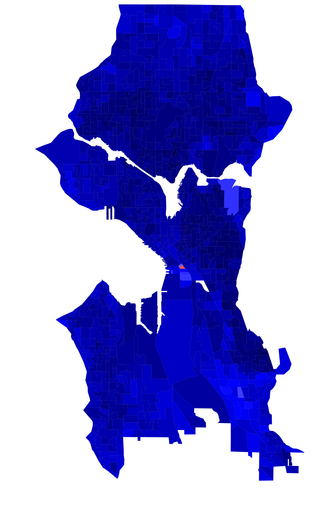
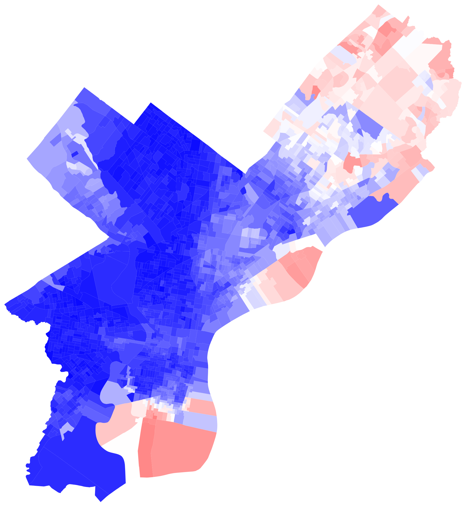
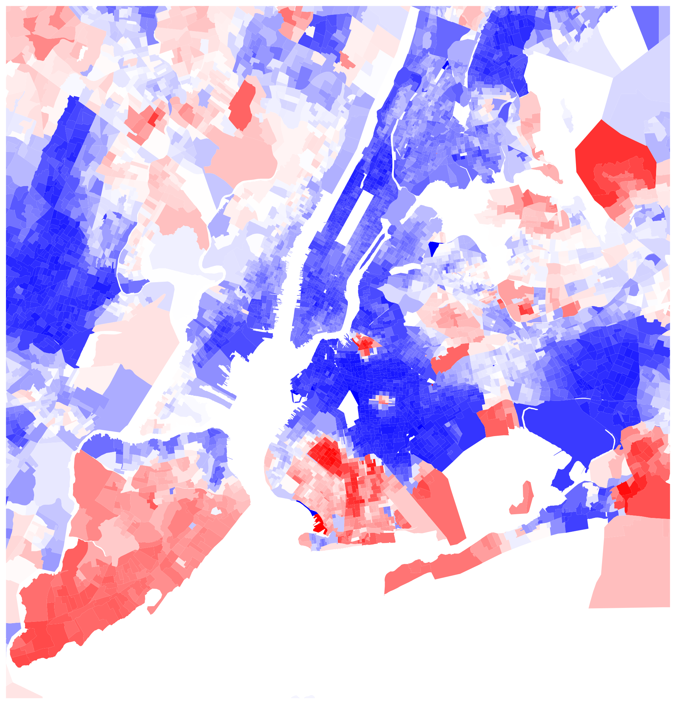
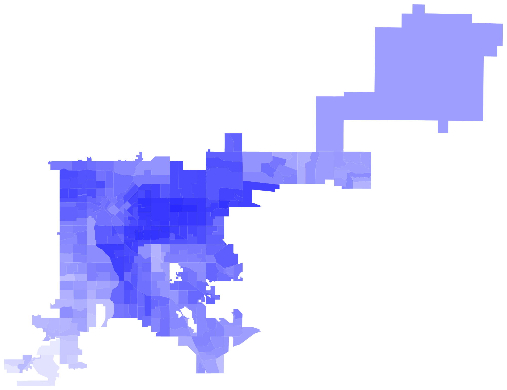
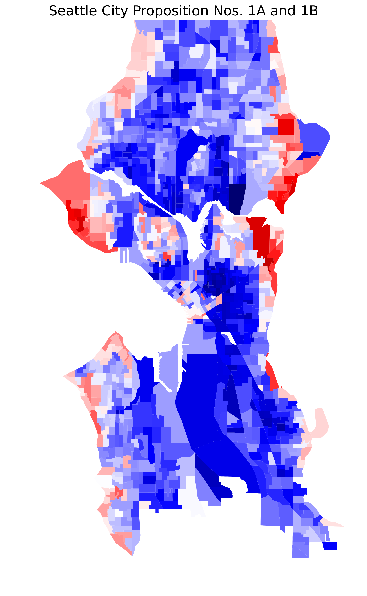

# City-Votes-Since-2024
**Purpose:** This repo contains utility scripts for parsing and analyzing municipal voting records from 2024 onward.

**Use case:** Intended for election enthusiasts and others tracking precinct-level vote trends.

  
  
  
  
  

## Content: 
### 1) 2024 General Election
1. Seattle, WA
2. New York, NY
3. Miami, FL
4. Chicago, IL
5. Portland, OR*
6. Las Vegas, NV
7. Minneapolis, MN
8. Denver, CO
9. Philadelphia, PA
10. San Francisco, CA
11. San Diego, CA
12. San Jose, CA
13. Madison, WI
14. Atlanta, GA*
15. Pittsburgh, PA

*: Precinct boundaries were approximated in areas where misalignments occured between official city limits and available precinct shapefiles

### 2) 2025 Special/Primary/General Elections
1. Seattle (Seattle City Proposition Nos. 1A and 1B)

## Data Sources
1. November 2024 General Election Results - Final precinct level election results - Comma delimited file
([Download Link](https://cdn.kingcounty.gov/-/media/king-county/depts/elections/results/2024/11/final-results-report.csv))
2. Voting Districts of King County / votdst area - Shapefile
([Download Link](https://gis-kingcounty.opendata.arcgis.com/datasets/a9bcf8b7e83a402aaf68479c244b3131_418/))
3. "2024 Precinct-Level Election Results." New York Times, www.nytimes.com/interactive/2025/us/elections/2024-election-map-precinct-results.html. Accessed [05/01/2025].
4. "2024Precincts" [@21MetcalfJ](https://github.com/21MetcalfJ/2024Precincts)
5. IPUMS NHGIS, University of Minnesota, [www.nhgis.org](https://www.nhgis.org)
6. Map data from [OpenStreetMap](https://openstreetmap.org/copyright)

## Development Notes
- I used AI to scaffold plotting loops and CSV parsing loops.
- I then manually adapted the boilerplate code to:
  - Match voting data with precinct shapefiles by converting precinct ID formats
  - Set canvas bounding boxes to municipal boundaries (extracted via Overpass Turbo API queries)
  - Aggregate precinct-level voting data from multiple sources into a single GeoPandas DataFrame
  - For coastal regions, clip official voting precinct shapefiles to coastline data from NHGIS
